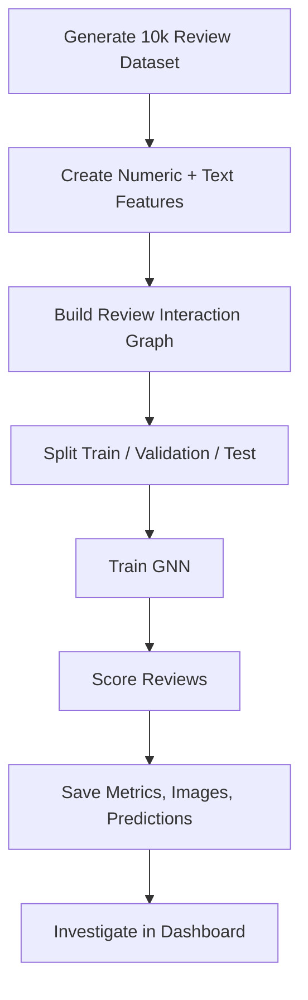

# SybilShield

SybilShield is a graph-based fake review detection project built to showcase a realistic fraud-detection workflow end to end: synthetic data generation, feature engineering, graph construction, GNN training, artifact generation, and a Streamlit dashboard for investigation.

The repository is now production-quality for portfolio use:

- scalable synthetic dataset generation with 10,000+ reviews
- multiple fraud behaviors, including collusion, burst campaigns, rating manipulation, text similarity attacks, and coordinated rings
- GCN and GAT training with saved metrics and comparison artifacts
- Streamlit diagnostics for ROC, confusion matrix, fraud score distribution, and suspicious cluster exploration

## Project Overview

Online review fraud rarely appears as isolated bad reviews. It usually shows up as coordinated behavior across reviewers, products, timestamps, ratings, and repeated text. SybilShield treats each review as a graph node and uses graph neural networks to detect suspicious coordination patterns.

## Architecture Diagram


## Workflow Diagram



## Repository Layout

```text
fake-review-detection/
├── app.py
├── artifacts/
├── scripts/
├── src/sybilshield/
├── CONTRIBUTING.md
├── LICENSE
├── README.md
└── requirements.txt
```

## Installation

```bash
cd fake-review-detection
python3 -m venv .venv
source .venv/bin/activate
pip install -r requirements.txt
```

Notes:

- `sentence-transformers` is optional at runtime in practice because the feature layer falls back to hashing features if the embedding model is not available locally.
- The visualization pipeline uses a non-interactive Matplotlib backend, so artifact generation works in headless environments.

## Usage

Generate the synthetic dataset:

```bash
python scripts/generate_dataset.py --num-reviews 10000
```

Train the primary model and also build the GCN vs GAT comparison:

```bash
python scripts/train.py --model gat --num-reviews 10000 --epochs 10 --compare-models
```

Launch the dashboard:

```bash
streamlit run app.py
```

## Synthetic Dataset Design

The generator now creates at least 10,000 reviews by default and injects the following fraud patterns:

- reviewer collusion
- burst reviewing in tight time windows
- rating manipulation with extreme polarity
- text similarity attacks using templated phrasing
- coordinated review rings targeting overlapping products

Each row includes `ring_id`, `attack_type`, and `campaign_id`, which makes the downstream analysis much easier to inspect and explain.

## Results

Fresh metrics were generated on the 10,000-review dataset on June 10, 2026.

Dataset summary:

- Reviews: `10,000`
- Fraud reviews: `2,400`
- Unique users: `1,492`
- Unique products: `307`
- Campaigns: `13`
- Graph edges: `161,971`

Model comparison:

| Model | ROC-AUC | Precision | Recall | F1 | Accuracy |
|---|---:|---:|---:|---:|---:|
| GCN | 0.9991 | 1.0000 | 0.4361 | 0.6074 | 0.8648 |
| GAT | 0.9990 | 1.0000 | 0.9944 | 0.9972 | 0.9987 |

Primary production artifact set currently points to the GAT run because it provides dramatically better recall while preserving precision.

## Saved Artifacts

Training produces:

- `artifacts/synthetic_reviews.csv`
- `artifacts/reviews_with_predictions.csv`
- `artifacts/metrics.json`
- `artifacts/model_comparison.json`
- `artifacts/history.csv`
- `artifacts/checkpoint.pt`
- `artifacts/graph.pkl`
- `artifacts/roc_curve.png`
- `artifacts/confusion_matrix.png`
- `artifacts/fraud_cluster.png`
- `artifacts/training_history.png`
- `artifacts/models/gcn/*`
- `artifacts/models/gat/*`

## Dashboard Features

The dashboard now includes:

- KPI cards for the latest run
- suspicious-cluster graph visualization
- ROC curve visualization
- confusion matrix visualization
- fraud score distribution chart
- GCN vs GAT comparison view when both are available
- top suspicious review table
- campaign-level breakdown
- inline display of the saved artifact images

## Screenshots

Generated screenshots and plots are saved under `artifacts/`:

- ROC curve: [roc_curve.png](artifacts/roc_curve.png)
- confusion matrix: [confusion_matrix.png](artifacts/confusion_matrix.png)
- fraud cluster: [fraud_cluster.png](artifacts/fraud_cluster.png)
- training history: [training_history.png](artifacts/training_history.png)

## Verification

The repository was re-verified with the following flow:

1. Install dependencies from `requirements.txt`
2. Generate a 10,000-review synthetic dataset
3. Train both GCN and GAT models
4. Save fresh metrics and images to `artifacts/`
5. Launch the Streamlit dashboard successfully in headless mode

## Future Improvements

- replace synthetic text generation with LLM-generated domain-specific review corpora
- add temporal graph neural networks for evolving campaigns
- support explainability views for node- and edge-level evidence
- add CI checks for dataset generation, training smoke tests, and dashboard validation
- persist experiments in a lightweight tracking layer such as MLflow
